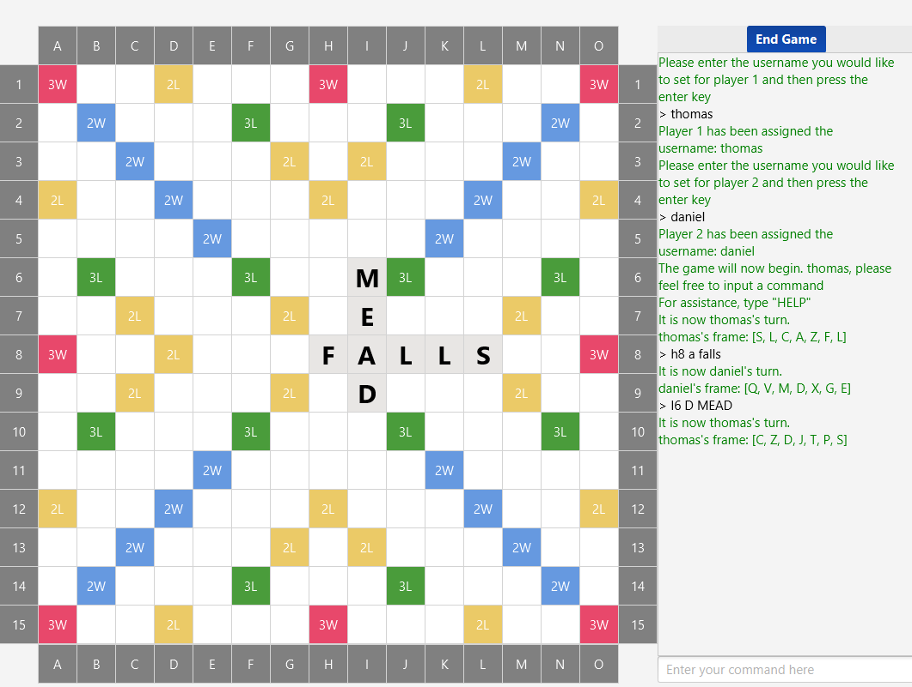

# Scrabble

This project contains code for an implementation of the board game Scrabble.
This project also involved writing our own version of a Bot which could play Scrabble, which can be found at [the following link](https://github.com/thomasogara/ScrabbleBot).

## Getting Started

To begin, please `git clone` the repository onto your local machine.

### Prerequisutes

There are a smalll number of prerequisites if you aim to **build and/or run** this project on your local machine.

* A Java Development Kit (JDK) for Java version 8.

#### JDK

The official Oracle JDK can be found at [oracle.com](https://www.oracle.com/java/technologies/javase-jdk8-downloads.html).
  
**Please ensure that the JDK installed on your system is added to the PATH environment variable.
You must be able to run the 'java' and 'javac' tools from the terminal in order to build and/or run this project.**

### Installation

Now that you have a JDK installed and available via the terminal, you are ready to install the project from source.

#### Building the project from source

To build the project from source, run the following commands from the terminal:

1. If there exists a directory named `/out/`, remove its contents. Otherwise, create an empty directory named `/out/`.
2. Run the following command from the terminal

        javac src/*.java -d out

The build process is now complete.

## Deployment

To begin, please ensure you have navigated into the root directory of the repository.

### Running the program locally

#### Launching the run script

To launch the application, execute the following command from the terminal.

    java -cp out BoardGUI

This will begin the execution the project code. If all goes well, the GUI shown in the above screenshots will be presented, and the game will be ready for play. By default, you will play against the Bot which uses the GADDAG move generation algorithm.

## Acknowledgements

* Chris Bleakley (School of Computer Science, University College Dublin, Belfield)
* Steven A. Gordon (Department of Mathematics, East Carolina University, Greenville)
